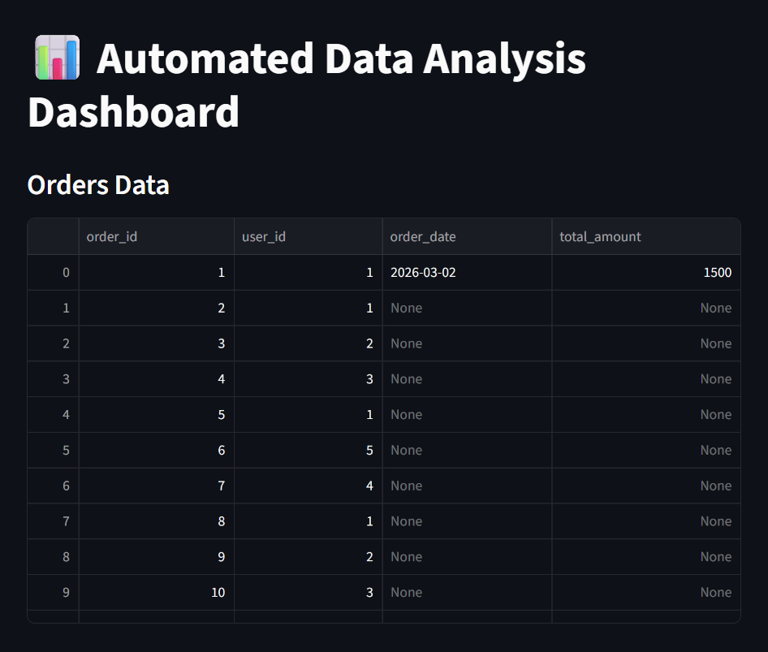

# 📊 Automated Data Analysis System

A Python-based automated data processing system that loads datasets, stores them in a database, analyzes them, and displays results through reports and an interactive dashboard.

---

## 🚀 Project Overview

This project demonstrates a complete **data pipeline workflow**:

CSV Data → Database Storage → Analysis → Reports → Dashboard Visualization

It is designed to simulate a real-world analytics system used in companies.

---

## ✅ Features Implemented

✔ CSV data import into database
✔ MySQL database integration
✔ Modular service architecture
✔ Automated report generation
✔ Logging system
✔ Streamlit dashboard interface
✔ Clean project folder structure

---

## 📁 Project Structure

```
Automated Data analysis system/
│
├── config/          # DB connection settings
├── Data/            # Input CSV datasets
├── models/          # SQL schema
├── services/        # Business logic modules
├── utils/           # Helper functions
│
├── load_data.py     # CSV → Database loader
├── dashboard.py     # Streamlit dashboard
├── main.py          # Main execution script
├── requirements.txt
└── README.md
```

---

## ⚙️ Installation & Run

### 1️⃣ Create virtual environment

```
python -m venv venv
```

Activate:

```
venv\Scripts\activate
```

---

### 2️⃣ Install libraries

```
pip install -r requirements.txt
```

---

### 3️⃣ Create Database

Open MySQL and run:

```
CREATE DATABASE automated_analysis;
```

Then execute:

```
models/schema.sql
```

---

### 4️⃣ Load Dataset

```
python load_data.py
```

---

### 5️⃣ Run Analysis

```
python main.py
```

---

### 6️⃣ Launch Dashboard

```
streamlit run dashboard.py
```

Open browser:

```
http://localhost:8501
```

---

## 📊 Sample Output

Example report result:

```
Total Sales : 4500
Total Orders: 15
```

---

## 🧠 Tech Stack

* Python
* MySQL
* Pandas
* Streamlit

---

## 🎯 Learning Outcomes

This project demonstrates understanding of:

* Database integration
* Data pipelines
* Modular coding design
* Reporting systems
* Dashboard visualization

---

## 👨‍💻 Author

**Manjunath**

---

## 🔮 Future Improvements

* Charts and graphs
* API integration
* Authentication system
* Cloud deployment

---

## 📊 Dashboard Preview

### Main Dashboard


### Products View


### Orders View


### Users View
